# Steps for receiving feedback on laboratories on Github

## Installing git

This step has to be done **only if** you don't have `git` installed.

In a terminal, run the command:

```bash
sudo apt-get install git
```

## Configuring a ssh key on Github

### Generating a ssh key

This step has to be done **only if** you don't have a SSH Key added to your account.

* In a terminal, generate a ssh key:

```bash
ssh-keygen -t rsa -b 4096 -C "your_email@example.com"
```

At all prompts, press `Enter` (default values will be selected).

* The output should be simillar to:
```bash
Generating public/private rsa key pair.
Enter file in which to save the key (/root/.ssh/id_rsa): 
Created directory '/root/.ssh'.
Enter passphrase (empty for no passphrase): 
Enter same passphrase again: 
Your identification has been saved in /root/.ssh/id_rsa
Your public key has been saved in /root/.ssh/id_rsa.pub
The key fingerprint is:
SHA256:mU6y9J1AY8msPRHoaE5wm5lTtqtVEBYQiUiaTmBG6v8 your_email@example.com
The key's randomart image is:
+---[RSA 4096]----+
|+* .o+++.        |
|B.o o.=o o       |
|+. o X oO        |
|+   X o=.=       |
| o + .+oS        |
|  . ..o* + .     |
|   . o. o o      |
|    o            |
|     E           |
+----[SHA256]-----+
```

* To view your **public** ssh key:

```bash
student@student:~ cat ~/.ssh/id_rsa.pub 
ssh-rsa AAAAB3NzaC1yc2EAAAADAQABAAACAQDdawfZAFXk8CUJH1znkUjApV1uPMnWw650CJA09z3CIkCjNeThYAsBGNsFiR8Czmej0bxUF74ihLwCSj/RDL0NBA/XRzohnSYFZtrA5HlJeuiIjMpKB7FLQeSbhJdnzq/HsQrw9t/qYe6/qutZzC6SvGJfoeyAs30scMIeuIYwJk/Td8zVkfklz+ETqdyWwrZG/9ISsLAvEN7/cGvEGC76D1cR3wKV+itzQq5+f/TUXUXYURR+SkuADXrEk+JFzINXbdLNgnWvwvwCKPfp4rI/wyy2GxHW/48+zcHDB8wzb63+bLIdMarPBr9HycqZp1Bdx1wQzGrS7WJQwbNy2NGC9ciqtl+yUj5DMaaAIdFXidJawXu/ObVE6U8Yb1S7aFOvsQEIlNWEdtXU34+v5vQOilB2sKEQt1XDFTHl8jyoDB5NdOiRBmHClNpoBlRGnBcX/stMOlUppkrHY7WR8eb476lzwGBwx12PCBvYwckqo/vIR5kHAjgNSoeHBcHvQ7IdVjVzgMSBSafrafalkIgpKADVqH9rLBzj+x10Koo1zWBkQI9D5dWuoA04U7KEDT/wkiOtC8XmNX6kmXh5gtkgHvGi6YAsVem244mBrdO/kTXbioxXQyjv2/N+JFZdWUY4s6jeWHqgnecKL2LVLh8pzQSc2KVAJLZWSk0mofNAQw== radunichita99@gmail.com
```

### Adding it on Github
* From a browser, access the [SSH keys page](https://github.com/settings/keys)

* Press on `New SSH Key`. Complete with a proper title (e.g:  `Faculty Key`) and paste the output from the `cat` command from the previous step, beginning with (`ssh-rsa`) 

* Press `Add SSH Key`. If requested, complete with your password.


# Forking the official repository

* From a browser, access the [repo link](https://github.com/systems-cs-pub-ro/iocla) and press on the `Fork` button.

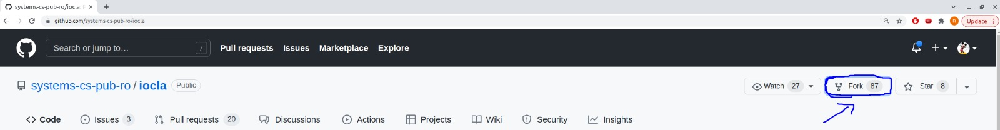


# Cloning the fork 

* From a browser, access your fork (on most cases, you can access `github.com/<your_username>/iocla` and press on `Code`

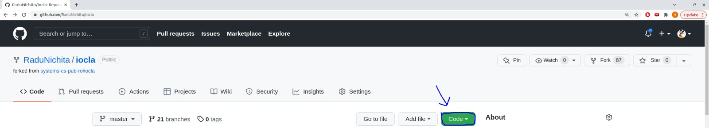

* Choose `SSH` option and copy the link:

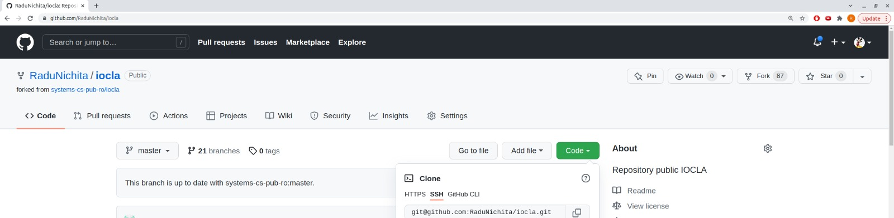

* In a terminal, run the command `git clone <copied_link>`. In most of the cases, the link should be `git@github.com:<your_username>/iocla.git`:

```bash
git clone git@github.com:RaduNichita/iocla.git
```


# Steps for every lab:

* Create a new `branch` 

```bash
student@student $ git checkout master
student@student $ git pull
student@student $ git checkout -b lab<x>
```

* Solve the lab

* Add the `source files` / `Makefile` (**do not** add binary files)

```bash
git add /path/to/edited/files
```

* do a commit (add a suggestive message too):
```bash
git commit -m "add solution for lab<xy>"
```

* push the changes
```bash
git push -u origin lab<xy>
```

# Create a pull-request (PR)

* From the browser, access the fork link. You should see something similar:

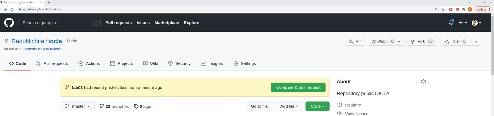

* At the base repository, **you need to change** to be your **forked master**, **not the official repo master**

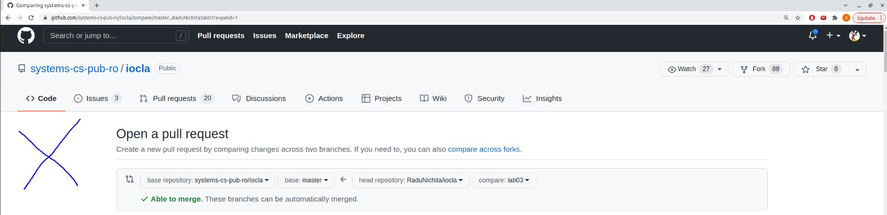

* Select your branch

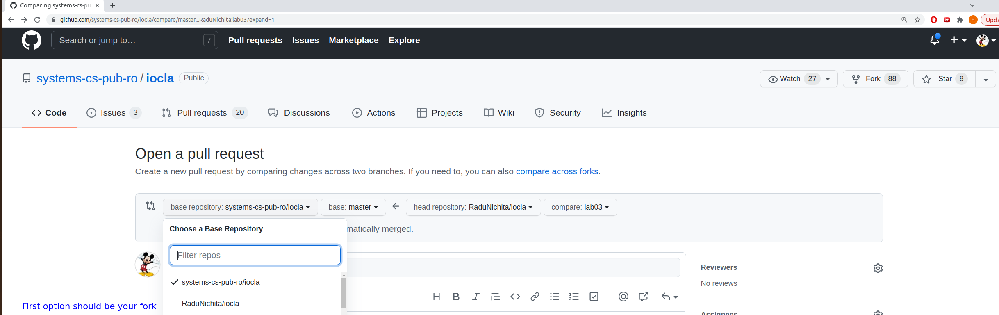

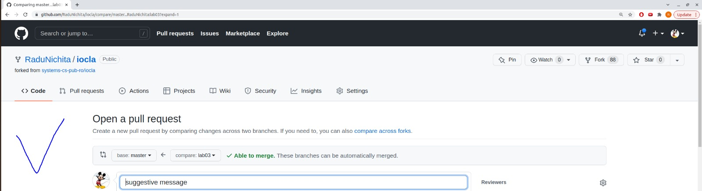

* Add the assistant for review (make sure it's added using the steps from the `Giving permissions to assistant` section)

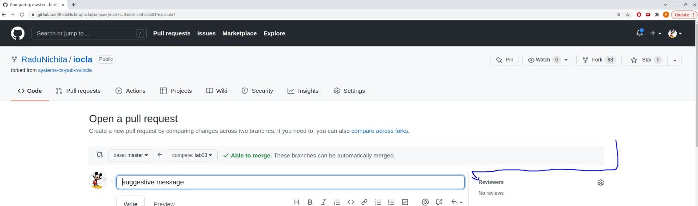


# Giving permissions to assistant

* From the browser, access the fork link and go to `Settings` tab: 
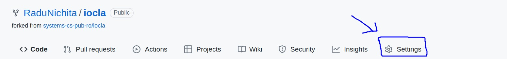

* Go to `Collaborators` tab:
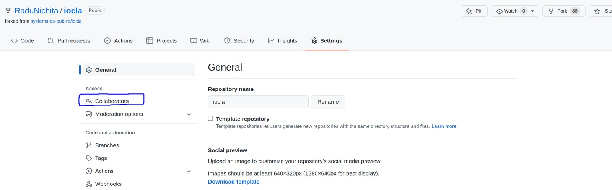

* Press on `Add people` green button and add the assistant

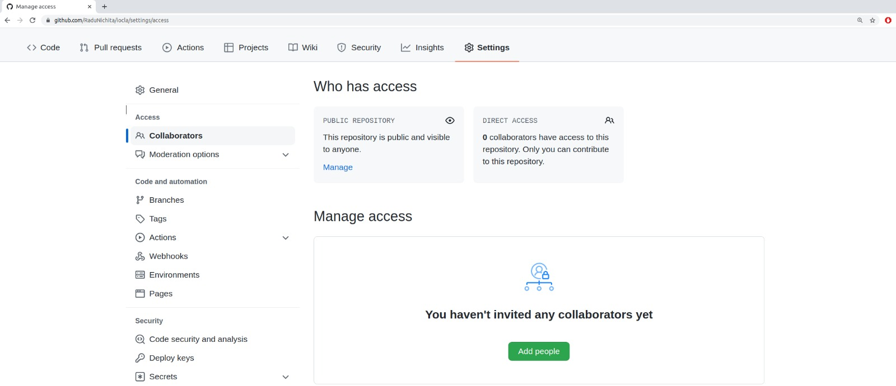


# Other resources:

* [`Git tips ROSEDU`](https://techblog.rosedu.org/git-good-practices.html), written by RD

* [`SD-CA` tutorial for ClassRoom](https://ocw.cs.pub.ro/courses/sd-ca/laboratoare/tutorial-github-classroom)
